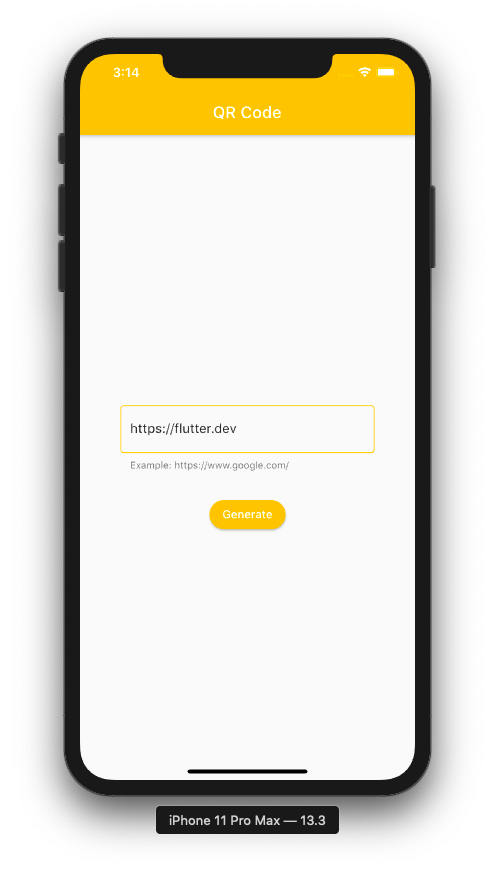

# QR Code Generator

Generate QR Code using Flutter

## Screenshots

## Created By

[Ganeshprasad Shenoy](https://github.com/shenoyganeshprasad)
[@ganeshprasad98](https://twitter.com/ganeshprasad98)

> If you found this project helpful or you learned something from the source code and want to thank me, consider buying me a cup of coffee

> [PayPal](https://www.paypal.com/paypalme2/shenoyganeshprasad)

## Credits 

[QR Code API](http://goqr.me/api/)